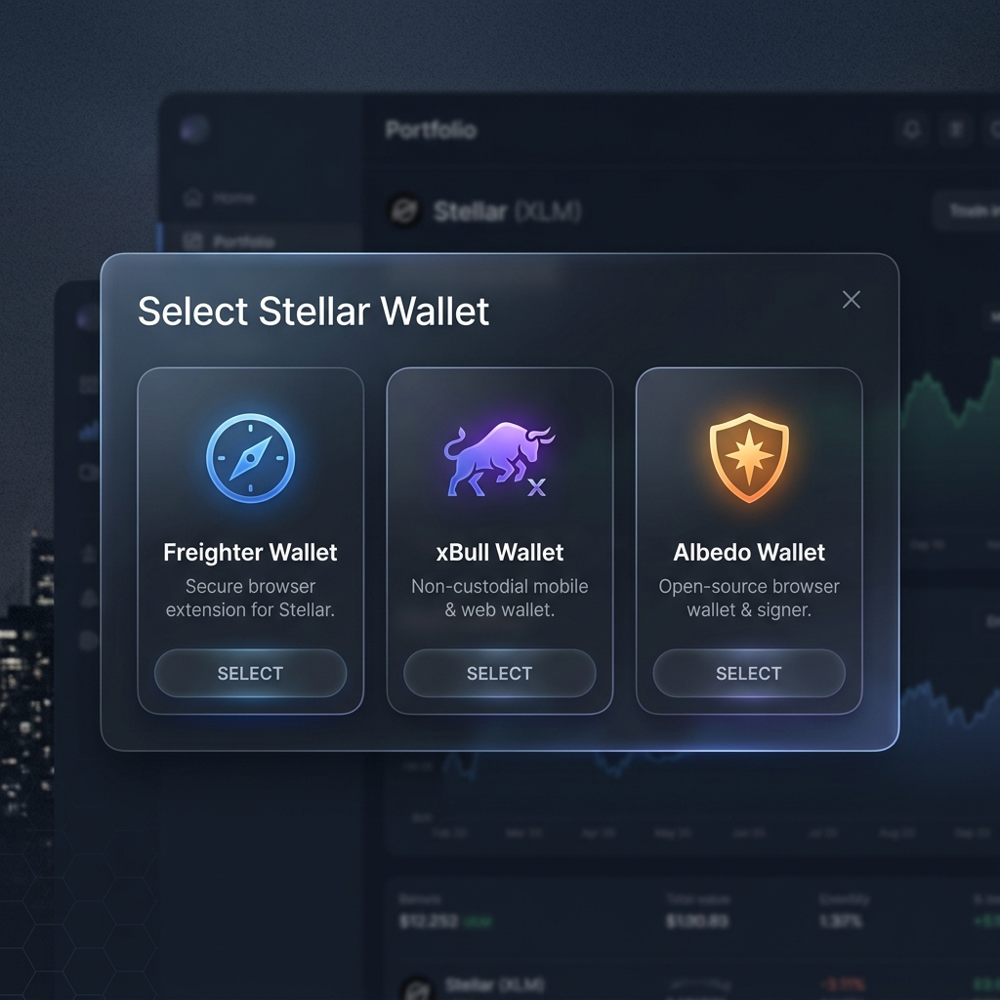
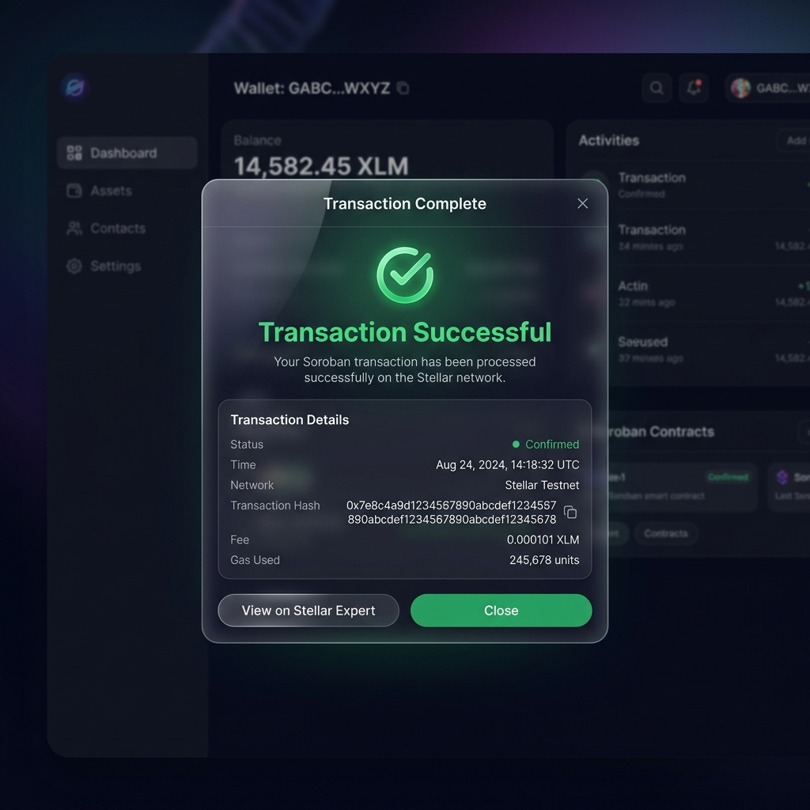

# Stellar Yellow Belt: Crowdfund dApp

A premium decentralized crowdfunding platform built with SvelteKit and Soroban smart contracts on the Stellar Testnet.

## 🚀 Features
- **Multi-Wallet Support**: Integrated with `StellarWalletsKit` (Freighter, xBull, Albedo).
- **Real-Time Progress**: Dynamic progress bars and donor lists that update instantly via network events.
- **Premium UX**: High-fidelity glassmorphism design with gold accents and smooth animations.
- **Robust Error Handling**: Specific notifications for "Insufficient Balance", "User Rejected", and "Wallet Not Found".
- **Transaction Tracking**: Live status updates with direct links to Stellar Expert.

## 🛠️ Setup & Installation

### Prerequisites
- Node.js (v18+)
- Stellar CLI ([Installation Guide](https://developers.stellar.org/docs/build/smart-contracts/getting-started/setup))
- Rust & Soroban target (`rustup target add wasm32-unknown-unknown`)

### Clone & Install
```bash
git clone https://github.com/your-username/stellar-crowdfund.git
cd stellar-crowdfund
npm install
```

### Environment Variables
Create a `.env` file in the root:
```env
PUBLIC_STELLAR_NETWORK=testnet
PUBLIC_RPC_URL=https://soroban-testnet.stellar.org
```

## 📜 Smart Contract Deployment

The project is currently configured to interact with the following deployed contract on **Stellar Testnet**:

- **Contract ID**: `CDZZY6ICYSPI2HXQOAMV6KV255UMN7ITQL4NDFSOOMG4X5NPI6FRYDRD`
- **Network**: Testnet
- **Status**: Active

### To Redeploy:

1. **Build the contract**:
   ```bash
   cd contracts/crowdfund
   stellar contract build
   ```

2. **Deploy to Testnet**:
   ```bash
   stellar contract deploy \
     --wasm target/wasm32-unknown-unknown/release/stellar_crowdfund.wasm \
     --source my-test-account \
     --network testnet
   ```
   *Copy the new Contract ID and update `src/lib/constants.ts`.*

## 💻 Running Locally

```bash
npm install
npm run dev
```
Open [http://localhost:5173](http://localhost:5173) to view the dashboard. All donations are automatically routed to the primary contract.

## 🖼️ Interface
### Wallet Options


### Transaction Success


## 📄 Samples
- **Contract ID**: `CDZZY6ICYSPI2HXQOAMV6KV255UMN7ITQL4NDFSOOMG4X5NPI6FRYDRD`
- **Sample TX Hash**: `877ac53b2ae225ee7d70d56969bbf35e2f6168c8728cc0744fb2696deda69c2a`

## 🛡️ License
This project is licensed under the MIT License.
